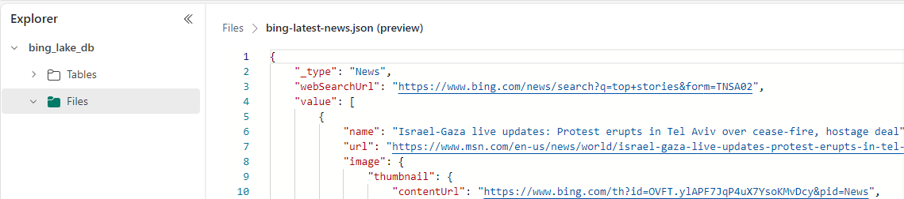
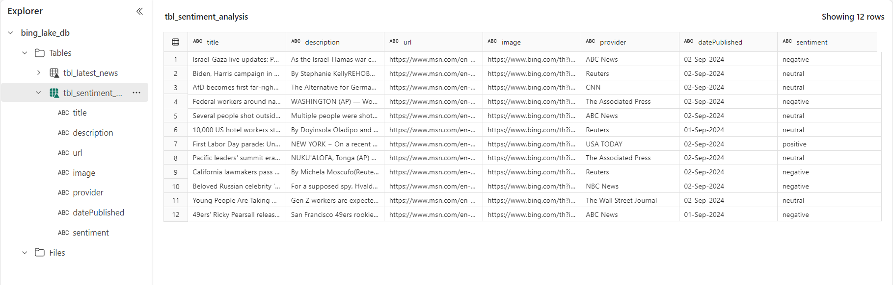

# Bing News Data Analytics with Microsoft Fabric

## Overview

In this project, we leverage the capabilities of Microsoft Fabric to build a robust data engineering pipeline for analyzing Bing News data. This tutorial guides you through setting up the environment, creating essential resources, and configuring workflows to ensure a seamless data processing experience.

## Project Goals

1. **Data Ingestion**: Set up a continuous and reliable data ingestion pipeline using Azure Data Factory.

2. **Data Transformation**: Implement data transformation techniques with Synapse Data Engineering, focusing on incremental loading for efficient processing.

3. **Sentiment Analysis**: Utilize Synapse Data Science to perform sentiment analysis on news articles through text analytics machine learning models.

4. **Data Reporting**: Create insightful visualizations with Power BI to display key metrics and trends.

5. **Proactive Alerts**: Set up proactive alerts using Data Activator to ensure reliable data processing and prompt notifications.

## Technologies Used

- **Data Source**: Bing News API
- **Orchestration**: Microsoft Fabric Data Factory
- **Storage**: Microsoft Fabric
- **Transformation**: Synapse Data Engineering
- **Sentiment Analysis**: Synapse Data Science
- **Reporting**: Power BI
- **Alerting & Monitoring**: Data Activator

## Architecture

The architecture diagram below outlines the components and flow of the project:

## Implementation Steps

1. **Ingestion**: Establish a pipeline in Azure Data Factory to ingest data from Bing News, configure data sources, set up triggers, and ensure continuous data flow into the system.

2. **Transformation**: Perform data transformation tasks in Synapse Data Engineering, including incremental loading with Type 1 updates (where existing records are updated with new data). Implement pipelines to clean, enrich, and structure data for analysis, ensuring it is ready for insights.

3. **Sentimental Analysis**: Utilize Synapse Data Science to perform sentiment analysis on news articles using text analytics machine learning models and interpret sentiment scores to gain insights into news trends.

4. **Reporting**: Build interactive reports and dashboards in Power BI to visualize data insights, including sentiment analysis results and other key metrics.

5. **Activator**: Set up proactive alerts using Data Activator to configure alerts for data anomalies and system events, ensuring timely responses and maintaining data pipeline reliability.

## Conclusion

This project showcases the powerful capabilities of Microsoft Fabric in building an end-to-end data engineering pipeline for Bing News analytics. By following the steps outlined, we can seamlessly ingest, transform, analyze, and visualize news data, while maintaining high reliability and responsiveness with proactive alerting. This comprehensive approach not only enhances our data processing skills but also empowers us to derive meaningful insights from large-scale news data.